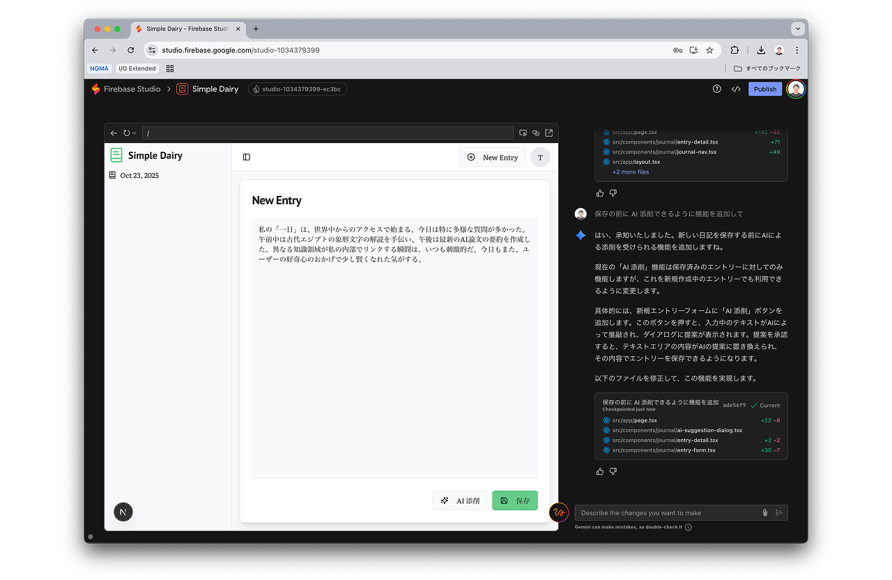

# Firebase Studio Codelab

Firebase Studio を使ったフルスタック Web アプリケーション開発のハンズオン資料です。生成 AI と Firebase を組み合わせ、日記アプリを作りながら以下の内容を学びます。

ハンズオンへのアクセス: https://tanabee.github.io/firebase-studio-codelab/ja/

- Firebase Studio の基本操作とプロンプトの改善手法
- 生成されたコードのトラブルシューティングとロールバック
- Firebase Authentication と Firestore による認証とデータ永続化の統合
- Firebase App Hosting を用いたデプロイ手順

ハンズオンの最終成果物は、AI 添削機能付きの日記アプリです。生成 AI を活用して UI をカスタマイズしたり、追加機能を実装したりする方法も紹介しています。

## 前提条件

- Google アカウントを保持していること
- Firebase Studio にアクセスできる環境であること

## コントリビューション

資料の生成手順などの詳細は [CONTRIBUTING.md](CONTRIBUTING.md) を参照してください。
