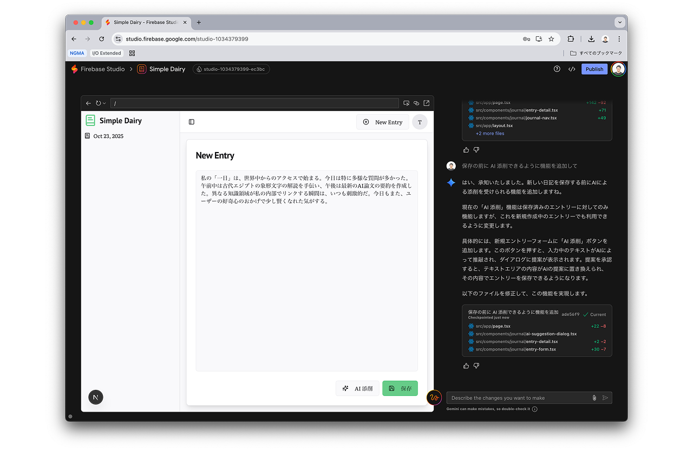

authors: Yuki Tanabe
summary: Firebase Studio Hands-on
id: ja
categories: firebase,javascript
environments: Web
status: Published
url: https://tanabee.github.io/firebase-studio-codelab/ja/
feedback_link: https://github.com/tanabee/firebase-studio-codelab/issues

# Firebase Studio でつくるフルスタックアプリケーション

## Intro
Duration: 0:01:00

このハンズオンでは Firebase Studio を用いて、フルスタックな Web アプリケーションを構築します。

### この Codelab で得られること

- Firebase Studio の基本的な使い方
- Firebase Studio におけるトラブルシューティング方法
- Firebase Studio を用いたフルスタックなアプリケーションの構築方法
- Firebase Studio を用いてアプリケーションに AI 機能を組み込む方法
- Firebase Studio で作ったアプリを Firebase 環境にデプロイする方法

### 最終成果物

以下のような AI 添削機能が組み込まれた日記アプリを開発します。（生成 AI を用いるため、同一のものが出来上がる訳ではありません。）



技術スタックは以下の通りです。

#### 技術スタック

- Web 配信: Firebase App Hosting
- データベース: Firestore
- 認証: Firebase Authentication

### 前提条件

- Google アカウントを持っていること

## Firebase Studio を触ってみる
Duration: 0:05:00

[https://studio.firebase.google.com](https://studio.firebase.google.com/) を開きます。

以下のようなプロンプトを入力します。

```
日記アプリを開発してください。
ユーザーが入力した内容に対して、保存前に添削できる AI 添削機能をつけてください。
最初は認証やデータベース接続は不要で、メモリ上に一時的に保存できればよいです。
```


しばらくするとアプリのブループリントが出来上がるので、気になるところをカスタマイズし、「Prototype this App」を選択して生成を開始します。


Gemini の API キーを求められたら、以下のサイトから API キーを作成します。

[https://aistudio.google.com/api-keys](https://aistudio.google.com/api-keys)


Web アプリケーションが作成されます。


## トラブルシューティング
Duration: 0:05:00

### エラーの解消

エラーが発生した場合の解決方法を紹介します。左下のアイコンからエラー内容を確認できます。

エラーを開いて `Fix Error` というボタンが表示された場合には、ボタン選択で該当のエラーの修正を進めてくれます。


`Fix Error` ボタンが表示されない場合にはエラー内容をコピーして貼り付ければ OK です。


### 前の状態に戻す

途中でエラーになって修正できない場合には前の正常な状態に戻した方が良い場合もあります。

ユーザーからのメッセージ毎にチェックポイントが作成されるので、 Restore ボタンを選択すると特定のタイミングに戻すことができます。


### 効果的なプロンプト

生成された結果が期待どおりでない場合は、詳細を追加することや、具体的な指示を提供することで、プロンプトを調整できます。公式ドキュメントの [追加のプロンプトを使用して回答の質を高める](https://firebase.google.com/docs/studio/prompting?hl=ja#refining-prompts) を参考に修正依頼をしましょう。

- **制約を追加する**: UI、データモデル、または機能に関する制約を規定します。
- **例を示す**: ユーザーがアプリを操作する方法と表示されるデータの例を示します。
- **キーワードを使用する**: LLM が必要な出力のクラスに関連付けることができる機能を記述するには、キーワードを使用します。たとえば、アプリが Google のデザイン基準に準拠していることを示すプロンプトでマテリアル デザインを使用できます。
- **特定の変更を依頼する**: 生成されたコードまたはブループリントの特定の変更を依頼します。各機能リクエストは別々のリクエストで追加してください。
- **モデルに推論を依頼する**: 目的の結果が得られないトラブルがある場合は、プロンプトを使用して推論するようにモデルに依頼してみてください。たとえば、こう依頼します。「順を追って考えてください。タスクアプリの入力ボックスを作成したい。[タスクを追加] ボタンと [キャンセル] ボタンを含める必要があります。

## カスタマイズを依頼する
Duration: 0:03:00

簡単なカスタマイズを依頼してみます。カスタマイズの例を以下にいくつか紹介します。

- アプリケーションで使用する色を変更する
- アプリ名を変更する
- 細かいテキストを修正する

### アプリケーションで使用する色を変更する


### 細かいテキストを修正する


## 認証とデータベースの追加
Duration: 0:05:00

以下のプロンプトを送信して、認証とデータベース機能を追加します。

```
以下の仕様で認証機能の追加とデータベースとの接続をお願いします。

- 認証：Firebase Authentication
  - メールアドレスとパスワードによる認証
  - 機能
    - サインアップ
    - ログイン
    - ログアウト
- データベース: Firestore
  - 日記の保存先: users/:userId/posts/:postId
```

※ [Firebase Studio の公式ドキュメント](https://firebase.google.com/docs/studio/get-started-ai?hl=ja#iterate) では「ヒント: アプリ プロトタイピング エージェントは、初期のアプリ ブループリントではなく、イテレーション フェーズでアプリに Cloud Firestore と Firebase Authentication を追加できます。」と記載があります。そのため、最初のプロンプトではなく、このタイミングで認証とデータベース接続を行います。

サインアップと日記の投稿をして動作を確認します。実際に Firebase Authentication と Firestore と接続されているか確認します。まずは以下の画像のオレンジの枠の部分を選択して Firebase Project に移動します。


Authentication メニューを見ると、サインアップされたユーザー情報が追加されています。


Firestore メニューを見ると、投稿された日記の内容が保存されていることを確認できます。


## Firebase 環境へのデプロイ
Duration: 0:05:00

Firebase 環境にデプロイすると、自分以外のユーザーに使ってもらうことができます。

Publish ボタンを押します。


Google Cloud Platform の課金情報と紐づけます。これは Firebase App Hosting を利用するために必要な手続きですが、ある程度の規模までは無料枠の範囲で利用可能です。


デプロイが成功すると生成された URL からアクセスできるようになります。


## Congrats!
Duration: 0:01:00

以上でこのハンズオンは終わりです。時間に余裕のある方はカスタマイズしてみてください。カスタマイズの例をいくつか紹介します。

- 日記をサイドバーに一覧表示させる
- カレンダー表示して指定した日の日記にアクセスできる
- 日記のタイトルを生成 AI で作ってもらう
- 生成 AI を用いた特定の期間（週・月など）のサマリ生成
- 日記の公開・非公開の制御
- ユーザー間のフォロー機能

また、もっと Firebase Studio を深く理解したい人向けは以下のリンクからより詳しい情報を得られます。

### 参考リンク

- [Firebase 公式ドキュメント](https://firebase.google.com/docs/studio?hl=ja)
- [Model Context Protocol（MCP）サーバーに接続する](https://firebase.google.com/docs/studio/mcp-servers?hl=ja)
- [Firebase Studio テンプレートを使ってみる](https://firebase.google.com/docs/studio/get-started-template?hl=ja&template_type=official)
- [Firebase Studio の料金、割り当て、上限](https://firebase.google.com/docs/studio/pricing?hl=ja)
- [アプリを GitHub にアップロードする](https://firebase.google.com/docs/studio/github?hl=ja)
- [Enhance Your Firebase Studio Workflow with Gemini CLI](https://firebase.blog/posts/2025/07/firebase-studio-gemini-cli/)
- [Bridge the design to development gap with Builder.io and Firebase Studio](https://firebase.blog/posts/2025/09/firebase-studio-builder-io-design-development)